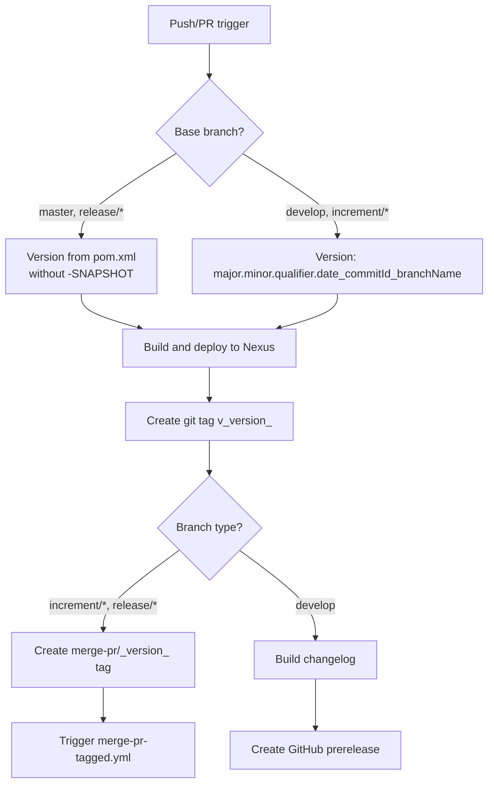
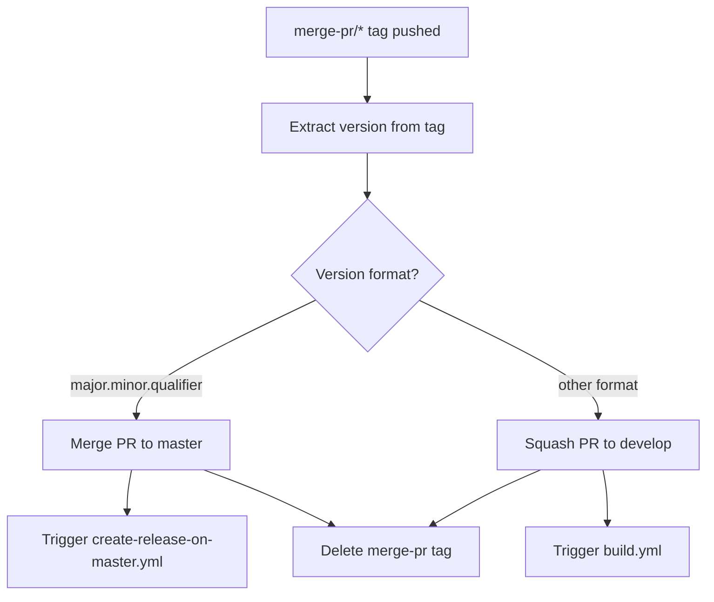
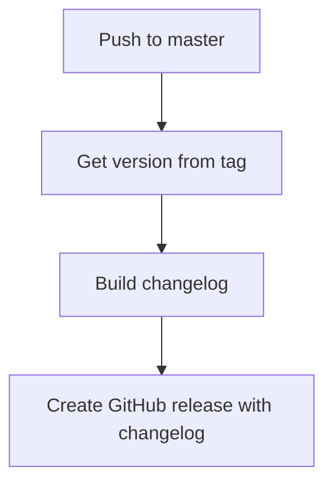
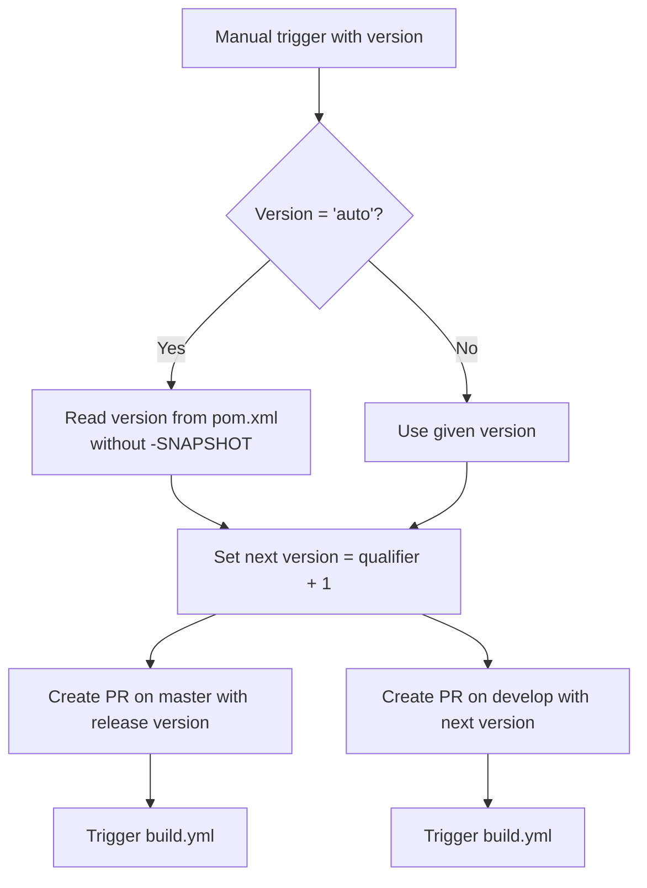

# Development Version and Branch Handling

## Branches

The versioning policy follows [GitFlow](https://www.atlassian.com/git/tutorials/comparing-workflows/gitflow-workflow).

| Branch Pattern | Purpose |
|---------------|---------|
| `develop` | Main development branch — contains latest development sources of the active version |
| `feature/JNG-NUMBER_short_summary` | Feature branches based on `develop` for new functionality |
| `(release/)X.Y.Z` | Release branches (the `release/` prefix is reserved for CI) |
| `bugfix/JNG-NUMBER_short_summary` | Bug fixes based on release branches — must be applied to newer release and develop branches too |
| `support/JNG-NUMBER_short_summary` | Support branches based on release branches — same merge-forward rules as bugfix |
| `master` | Contains the latest released sources of the active version |

```mermaid
gitGraph
    commit id: "init"
    branch develop
    checkout develop
    commit id: "dev-1"
    branch feature/JNG-1
    commit id: "feat-1"
    commit id: "feat-2"
    checkout develop
    merge feature/JNG-1
    commit id: "dev-2"
    branch release/1.0-beta1
    commit id: "rc-1"
    branch bugfix/JNG-4
    commit id: "fix-1"
    checkout release/1.0-beta1
    merge bugfix/JNG-4
    checkout develop
    merge release/1.0-beta1
    checkout master
    merge release/1.0-beta1 id: "v1.0"
```

## Version Numbers

Version numbers follow semantic versioning with these rules:

| Event | Version Change |
|-------|---------------|
| Start a `feature/` branch | No change — inherits from `develop` |
| Start a `release/` branch | 2nd number on `develop` is incremented |
| Start a `bugfix/` branch | No change — applied on release branches during pre-release testing |
| Start a `support/` branch | 3rd number is incremented — used for minor updates to previous releases |
| Start a `hotfix/` branch | 4th number is incremented — applied to both release and master branches |

## GitHub Action Flows

The CI/CD pipeline consists of four interconnected GitHub Actions workflows.

### build.yml — Main Build

Triggered on pushes to `develop` or pull requests targeting `develop`, `master`, `increment/*`, or `release/*`.



### merge-pr-tagged.yml — PR Merge Handler

Triggered when a `merge-pr/*` tag is pushed.



### create-release-on-master.yml — Release Publisher

Triggered on pushes to `master`.



### release.yml — Manual Release

Triggered manually with a version parameter (`auto` or explicit `major.minor.qualifier`).



## How to Develop

Issue tracking uses [JIRA](https://blackbelt.atlassian.net/jira/dashboards).

> **Important:** There is no commit without a ticket number. Every pull request and commit must reference a `JNG-xxx` ticket.
