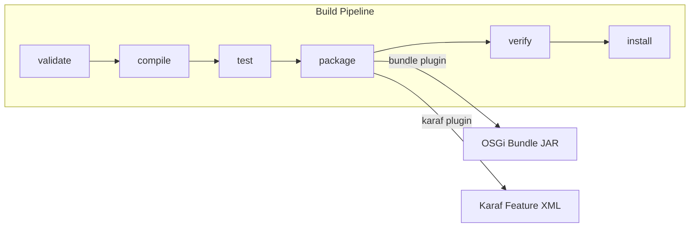

# Contributing to Jetty Metrics

## Development Environment

### Required Tools

| Tool | Version | Notes |
|------|---------|-------|
| JDK | 21+ | The `pom.xml` targets Java 21 (`maven.compiler.source`/`target`) |
| Maven | 3.8+ | A Maven Wrapper (`./mvnw`) is included — use it to avoid version mismatches |

Verify your setup:

```bash
java -version    # should show 21+
./mvnw -version  # should show Maven 3.8+
```

## Code Structure

This is a multi-module Maven project with two modules:

- **`jetty-metrics-impl`** — OSGi bundle containing the `JettyConfigurator` Declarative Services component. This is where all application code lives.
- **`jetty-metrics-karaf-features`** — Karaf feature descriptor that packages the bundle and its dependencies for deployment.



## Submission Guidelines

### Submitting an Issue

Before opening a new issue, search the [issue tracker](https://github.com/BlackBeltTechnology/jetty-metrics/issues) — your problem may already have been reported or resolved.

When filing a bug, include:

- Output of `java -version` and `mvn -version`
- Relevant `pom.xml` or `.flattened-pom.xml` content
- A minimal reproduction case that demonstrates the failure

File new issues via the [issue form](https://github.com/BlackBeltTechnology/jetty-metrics/issues/new/choose).

### Submitting a Pull Request

This project follows [GitHub's standard forking model](https://guides.github.com/activities/forking/). Fork the repository, make your changes, and submit a pull request.

For details on the CI/CD pipeline and branch handling, see [CI Flow](.github/CIFLOW.md).

## Commands

### Run Tests

```bash
./mvnw clean test
```

### Run Full Build

```bash
./mvnw clean install
```

### Run a Single Test Class

```bash
./mvnw test -pl jetty-metrics-impl -Dtest=TestClassName
```
