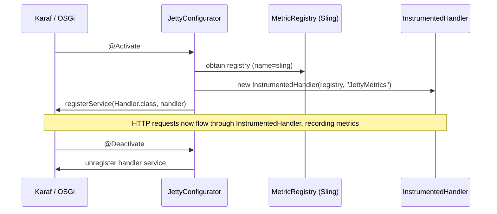
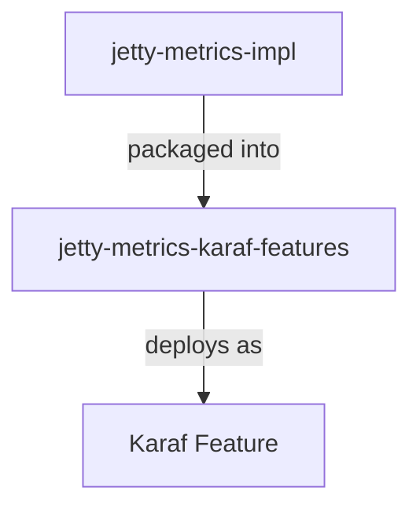
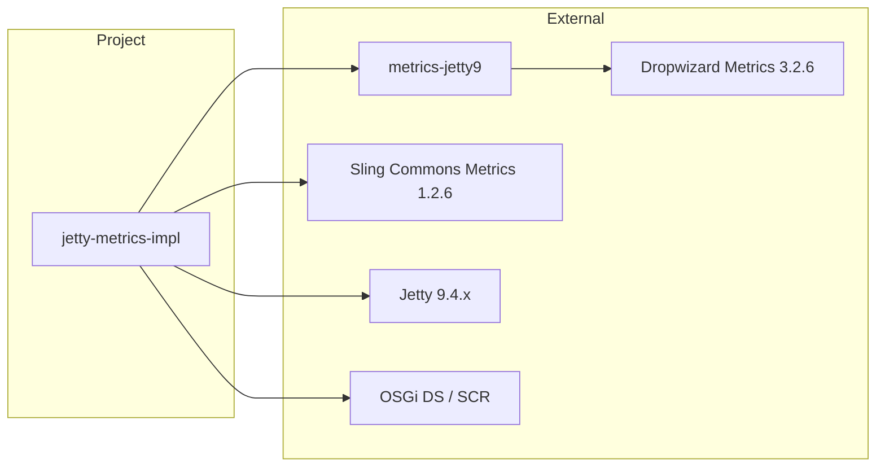

# Jetty Metrics

[](https://github.com/BlackBeltTechnology/jetty-metrics/actions/workflows/build.yml)

## Introduction

This project provides a metrics collector for Apache Karaf's embedded Jetty server. It uses [Dropwizard Metrics](https://metrics.dropwizard.io/) to instrument Jetty HTTP handlers, capturing request rates, response times, and status code distributions. The metrics are registered into the [Apache Sling](https://sling.apache.org/) MetricRegistry so they integrate with the existing Karaf metrics infrastructure.

## How It Works

The core of this project is a single OSGi Declarative Services component (`JettyConfigurator`) that:

1. Obtains a reference to the Sling-named MetricRegistry via OSGi `@Reference`
2. Wraps Jetty's handler chain with Dropwizard's `InstrumentedHandler`
3. Registers the instrumented handler as an OSGi service so Karaf picks it up automatically



## Module Structure



| Module | Packaging | Purpose |
|--------|-----------|---------|
| `jetty-metrics-impl` | OSGi `bundle` | Contains `JettyConfigurator` — the component that instruments Jetty with Dropwizard metrics |
| `jetty-metrics-karaf-features` | Karaf `feature` | Defines the `jetty-metrics` Karaf feature descriptor for one-step deployment into a Karaf container |

## Key Dependencies



## Build

This project uses Maven with a Maven Wrapper (`mvnw`). Java 21 is required.

```bash
# Full build
./mvnw clean install

# Skip tests
./mvnw clean install -DskipTests

# Build a single module
./mvnw clean install -pl jetty-metrics-impl
```

## Deployment

Install the `jetty-metrics` feature into a running Karaf instance:

```
feature:repo-add mvn:hu.blackbelt/jetty-metrics-karaf-features/<version>/xml/features
feature:install jetty-metrics
```

This installs the implementation bundle along with its Dropwizard and Sling Metrics dependencies.

## Contributing

See [CONTRIBUTING.md](CONTRIBUTING.md) for details on development setup, issue reporting, and submitting pull requests.

## License

This project is licensed under the [Apache License 2.0](http://www.apache.org/licenses/LICENSE-2.0).
